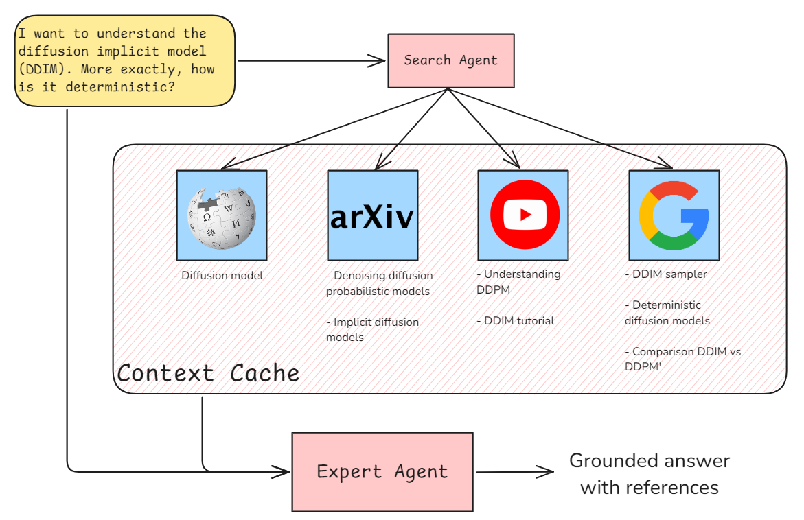

# Gemini-Becomes-an-Expert
By converting user queries into targeted searches across multiple platforms the algorithm ensures a thorough collection of information.

This is the code for the Kaggle competition: [https://www.kaggle.com/competitions/gemini-long-context](https://www.kaggle.com/competitions/gemini-long-context)

Unfortunately, I couldn't submit this since I already submitted one idea already [https://github.com/diegobonilla98/Gemini-Video-Highlights](https://github.com/diegobonilla98/Gemini-Video-Highlights).


## Summary
The idea builds on Google's Gemini LLM to offer detailed responses on specialized topics. It addresses the limitations of language models, such as their tendency to miss nuanced details or very specific formulas where accuracy is critical, or their lack of online knowledge, and their potential for generating incorrect information or "hallucinations." By converting user queries into targeted searches across multiple platforms—Wikipedia for foundational concepts, the web for in-depth technical details, YouTube for explanatory and comparative content, and Arxiv for scholarly articles—the algorithm ensures a thorough collection of information. A web scraping component then aggregates this data into a vast text file, often exceeding a million characters. This method provides a robust foundation of context, functioning as a solution to enhance the accuracy and depth of the responses generated by the LLM, mimicking the comprehensive research typically conducted by human experts.
When generating new text, there is a very naive implementation of "thinking before answering" to use the source material in the answer and provide sources.



Output:

DDIM is deterministic because it removes the stochastic element present in DDPM's sampling process.  Let's break down the key difference:

In DDPM (Denoising Diffusion Probabilistic Models), the reverse diffusion (sampling) process involves iteratively removing noise from a pure noise image to generate a sample. This process is *stochastic* because at each step, it adds random Gaussian noise.  This means that even with the same starting noise and the same model, DDPM can produce different final images due to the randomness injected at each step.

DDIM (Denoising Diffusion Implicit Models), on the other hand, modifies the sampling process to be *deterministic*.  It achieves this by eliminating the addition of random noise during the reverse diffusion process.  The equation for generating a sample `x_(t-1)` from `x_t` in DDIM is ([https://john-see.github.io/blog/2020/DDIM/](https://john-see.github.io/blog/2020/DDIM/)):

```
x_(t-1) = sqrt(α_t) * x_0 + sqrt(1-α_t-σ_t^2) * ε_θ(x_t) + σ_t * ε_t
```

where `ε_t ~ N(0, I)` is the random noise term.  DDIM sets `σ_t = 0` for all `t`, effectively removing this random noise.  This makes the sampling process entirely deterministic: given a starting noise image `x_T`, DDIM will always produce the same output `x_0`.

In essence, both DDIM and DDPM are trained using the same principle of learning to reverse a diffusion process. However, they differ in how they apply this learned knowledge during sampling. DDPM uses a stochastic sampling process, while DDIM employs a deterministic one by removing the random noise component.  This key difference allows DDIM to generate consistent outputs for a given input noise, while still benefiting from the training process of DDPM. Also, as explained in the HuggingFace documentation ([https://huggingface.co/docs/diffusers/v0.11.0/en/api/schedulers/ddim](https://huggingface.co/docs/diffusers/v0.11.0/en/api/schedulers/ddim)), DDIM allows for "trading off computation for sample quality" and performing "semantically meaningful image interpolation directly in the latent space," which are not possible with DDPM's stochastic nature.

